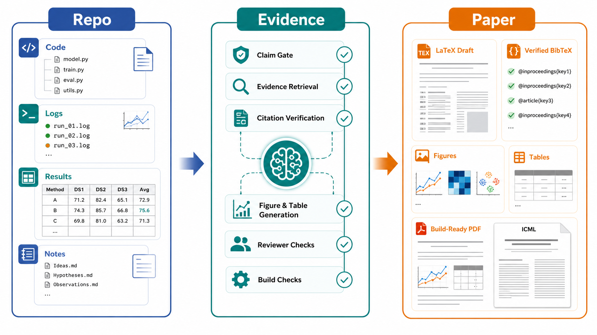
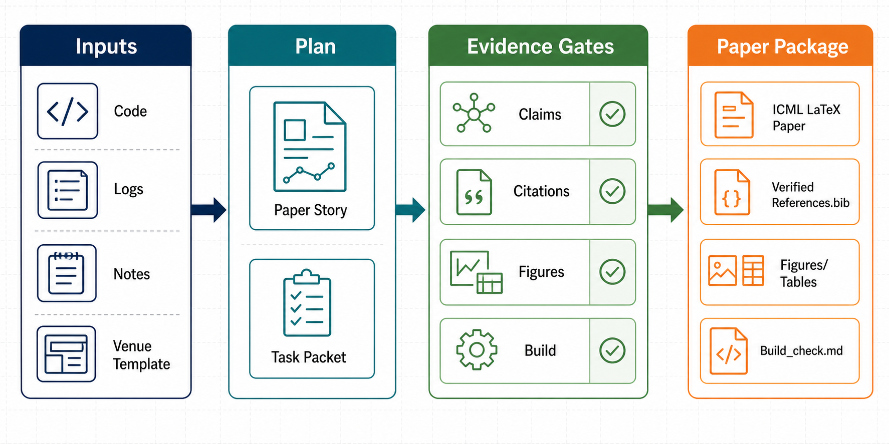

# AI Research Writing Skill

[中文说明](README.zh-CN.md)

[](LICENSE)
[](scripts/README.md)
[](#installation)
[](templates/README.md)

Turn an ML/AI research repo into an **evidence-backed, build-ready conference paper draft**.

Point your coding agent at code, experiment logs, notes, and a venue template. This skill helps it produce an auditable LaTeX draft and submission package: story, claim-evidence map, verified citations, figures, reviewer checks, and build notes.

> **Claim-evidence engineering, not prose generation.**  
> Every major claim should trace to code, results, notes, or verified citations.



---

## End-to-End Demo

```text
Use AI Research Writing Skill to write a complete system paper about this repository itself.
Treat ai-research-writing-skill as the research artifact.
Inspect SKILL.md, references/, scripts/, templates/, cross-platform plugin files, and README.
Create paper_story.md, claim_evidence_map.md, literature positioning, verified citations, ICML-style method figures/tables, and a build-ready ICML LaTeX paper under examples/paper-about-ai-research-writing-skill/paper/.
Do not invent performance numbers. Use repository facts as evidence.
```

The example already includes the expected final paper package, so you can inspect what an end-to-end output looks like:

- `evidence/repository_inventory.md`: repository facts used as evidence.
- `paper_story.md` and `claim_evidence_map.md`: story and claim boundaries.
- `literature/positioning.md` and `citation_verification.md`: related-project positioning.
- `paper/figures/method_overview.tex` and `paper/tables/*.tex`: ICML-style paper assets.
- `paper/main.tex`: complete paper draft about this project.
- `build_check.md`: compilation command, expected result, and residual risks.



## Why this skill

| Typical AI paper help | AI Research Writing Skill |
|---|---|
| Fluent paragraphs from memory | Claims mapped to repo evidence |
| Citations guessed or invented | BibTeX from arXiv / DOI / Semantic Scholar |
| Figure “plans” that never ship | Generated overview/method figures + deterministic result plots |
| Stops at an outline | Concrete artifacts: `paper_story.md`, `claim_evidence_map.md`, `references.bib`, figure files |
| Generic writing tips | Venue checklists, reviewer self-review, build & packaging gates |

**Supported venues (templates & checklists):** NeurIPS, ICML, ICLR, CVPR, ICCV, ECCV, ACL, AAAI, COLM, and related ML/AI conferences. Always verify [official author instructions](references/venue-templates.md) before submission.

## Before / After

| Before using this skill | After using this skill |
|---|---|
| Scattered notes, logs, and half-written sections | `paper_story.md` and scoped task packets |
| Claims that sound plausible | `claim_evidence_map.md` with evidence status |
| Candidate citations from memory | BibTeX fetched or verified from authoritative metadata |
| Figure ideas in prose | Generated concept figures and deterministic result plots |
| "Looks done" | Build, TODO, citation, reviewer, and submission checks |

## How It Differs From Related Projects

This project is not trying to replace the excellent research-writing and figure-making projects below. It narrows their ideas into one opinionated workflow: **turn an ML/AI research repository into an evidence-backed, build-ready conference paper package**.

| Project | What it is excellent at | How this project is different |
|---|---|---|
| [Master-cai/Research-Paper-Writing-Skills](https://github.com/Master-cai/Research-Paper-Writing-Skills) | A compact skill package for ML/CV/NLP paper writing, adapted from research-writing notes into reusable agent skills. | Adds a full repo-to-paper production contract: inventories, claim-evidence maps, verified BibTeX, figure assets, build checks, and submission packaging. |
| [Norman-bury/research-writing-skill](https://github.com/Norman-bury/research-writing-skill) | A broad, multi-platform research-writing assistant for thesis writing, chapter workflows, literature review, LaTeX output, and process tracking. | Specializes in AI conference papers from code, logs, experiments, and venue templates instead of general thesis/chapter writing. |
| [Orchestra-Research/AI-research-SKILLs](https://github.com/Orchestra-Research/AI-research-SKILLs) | A comprehensive AI research and engineering skills library for agents, spanning the broader research lifecycle from idea to paper. | Focuses on one deep vertical: paper-writing execution and submission readiness for an existing ML/AI research repo. |
| [Yuan1z0825/nature-skills](https://github.com/Yuan1z0825/nature-skills) | Nature/CNS-style academic writing, polishing, reviewer response, data availability, citation, and publication-quality figure workflows. | Targets ML/AI conference workflows and templates such as NeurIPS, ICML, ICLR, CVPR, ICCV, ECCV, ACL, AAAI, and COLM. |
| [ChenLiu-1996/figures4papers](https://github.com/ChenLiu-1996/figures4papers) | High-quality Python scripts and examples for publication figures in top AI conferences and journals. | Integrates figure planning into a larger paper pipeline: figures are tied to claims, evidence, captions, LaTeX references, and submission checks. |

In short: the related projects provide writing wisdom, broad skill ecosystems, Nature-style publication craft, or figure-making expertise. This project packages those inspirations into a **claim-evidence-engineering workflow for AI paper agents working inside real research repositories**.

---

## Quick start

**1. Install** (symlink into your agent’s skills directory, or use the bundled plugin metadata):

```bash
git clone https://github.com/jin-s13/ai-research-writing-skill.git
ln -s "$(pwd)/ai-research-writing-skill" ~/.cursor/skills/ai-research-writing-skill   # Cursor global
```

See [Installation](#installation) for Claude Code, Cursor, Codex, Gemini CLI, OpenCode, hooks, and project-level paths.

**2. Open your paper repo** in the agent and run:

```text
Use AI Research Writing Skill to inspect this repo and create paper_story.md and claim_evidence_map.md.
```

**3. Iterate by section** — for example:

```text
Use AI Research Writing Skill to revise Related Work: build a literature inventory and positioning analysis before drafting.
```

```text
Use AI Research Writing Skill to plan Figure 1 (method overview), generate the figure asset, and wire it into main.tex.
```

Bundled helper scripts use **Python 3 stdlib only** — no extra dependencies.

---

## What you get

End-to-end coverage from idea to camera-ready:

| Stage | Outputs |
|---|---|
| **Story** | Thesis, gap, contributions, claims to avoid |
| **Evidence** | `claim_evidence_map.md` tied to code / logs / tables |
| **Writing** | Abstract, Intro, Related Work, Method, Experiments, Limitations, Conclusion |
| **Literature** | Local corpus, positioning, verified `references.bib` |
| **Figures** | Plan + assets: **generated** overview/method diagrams; **deterministic** plots for numbers |
| **Review** | Reviewer-style risks, rejection diagnosis, self-review |
| **Submit** | Venue checklist, LaTeX build check, TODO/citation audit, packaging |

### Operating modes

The agent loads only what the task needs:

| Mode | When to use |
|---|---|
| Full-paper | Repo + results + template → draft or submission package |
| Story | Clarify thesis, gap, and contribution boundaries |
| Section | Revise one section with the right reference loaded |
| Figure | Plan diagrams and result plots; produce real files |
| Citation | Find, verify, repair BibTeX |
| Reviewer | Pre-submission risk scan |
| Submission | Checklist, build log, camera-ready checks |
| Automation | `scripts/` for claims, citations, TODOs, build logs |

Details: [`SKILL.md`](SKILL.md) and [`references/README.md`](references/README.md).

### Quality gates (built in)

The skill enforces checkpoints agents must not skip:

- **Evidence** — numbers from data/logs/scripts, not image models  
- **Story** — no full draft before contributions are explicit  
- **Literature** — positioning before Related Work prose  
- **Citation** — no unverified BibTeX without a visible placeholder  
- **Figures** — concept diagrams via image generation (default); TikZ/SVG only as optional reference  
- **Reviewer** — high-severity objections addressed before “done”  
- **Build** — compile or document why not  

---

## Installation

Clone this repo, then symlink/copy it into your agent’s skills folder or install it as a plugin where the platform supports plugins.

| Agent | Supported integration | Files in this repo |
|---|---|---|
| **Claude Code** | Plugin metadata + session hook, or skill symlink | `.claude-plugin/plugin.json`, `hooks/` |
| **Cursor** | Plugin metadata + session hook, or skill symlink | `.cursor-plugin/plugin.json`, `hooks/` |
| **Codex** | Native skill discovery | `SKILL.md`, `agents/openai.yaml`, `.codex/INSTALL.md` |
| **Gemini CLI** | Agent instruction entry | `GEMINI.md` |
| **OpenCode** | Plugin/local skill install | `.opencode/INSTALL.md`, `AGENTS.md` |
| **Generic agents** | Instruction file | `AGENTS.md` |

### Plugin Metadata

The repository includes thin platform entrypoints that all route back to the same root `SKILL.md`.

- Claude Code: `.claude-plugin/plugin.json`
- Cursor: `.cursor-plugin/plugin.json`
- Session-start hooks: `hooks/hooks.json`, `hooks/hooks-cursor.json`, `hooks/session-start`, `hooks/run-hook.cmd`
- Gemini CLI: `GEMINI.md`
- Generic/OpenCode-style agents: `AGENTS.md`

**Cursor — global**

```bash
mkdir -p ~/.cursor/skills
ln -s /path/to/ai-research-writing-skill ~/.cursor/skills/ai-research-writing-skill
```

**Cursor — project-level**

```bash
mkdir -p .cursor/skills
ln -s /path/to/ai-research-writing-skill .cursor/skills/ai-research-writing-skill
```

**Codex**

```bash
mkdir -p "$CODEX_HOME/skills"
ln -s /path/to/ai-research-writing-skill "$CODEX_HOME/skills/ai-research-writing-skill"
```

See [`.codex/INSTALL.md`](.codex/INSTALL.md) for details.

**Claude Code — global / project**

```bash
mkdir -p "$HOME/.claude/skills"
ln -s /path/to/ai-research-writing-skill "$HOME/.claude/skills/ai-research-writing-skill"
# or: .claude/skills/ for project-level
```

Claude Code plugin-aware installs can use `.claude-plugin/plugin.json`; the bundled session hook injects the root skill entry on startup.

**Gemini**

```bash
mkdir -p "$HOME/.gemini/skills"
ln -s /path/to/ai-research-writing-skill "$HOME/.gemini/skills/ai-research-writing-skill"
```

Gemini CLI can also read `GEMINI.md`, which points directly at `SKILL.md`.

**OpenCode**

See [`.opencode/INSTALL.md`](.opencode/INSTALL.md). The plugin/local install route points OpenCode back to the root skill.

---

## Repository layout

```text
ai-research-writing-skill/
├── .claude-plugin/       # Claude Code plugin metadata
├── .cursor-plugin/       # Cursor plugin metadata
├── .codex/               # Codex install notes
├── .opencode/            # OpenCode install notes
├── hooks/                # Session-start hook files for plugin-aware hosts
├── AGENTS.md             # Generic agent entry
├── GEMINI.md             # Gemini CLI entry
├── docs/                 # Launch and growth playbook
├── examples/             # Minimal demo paper repo
├── skills/               # Thin plugin-discovery wrapper back to root SKILL.md
├── SKILL.md              # Agent entry: modes, gates, evidence policy
├── references/           # Workflow, writing, citations, figures, venues, review
│   └── assets/           # Figure pattern references (figures4papers-style)
├── scripts/              # Claims, citations, TODOs, build-log, camera-ready checks
├── templates/            # NeurIPS / ICML / CVPR / ACL / … LaTeX starters
└── README.zh-CN.md
```

**Start here when digging in:**

| File | Purpose |
|---|---|
| [`references/workflow.md`](references/workflow.md) | Full-paper state machine |
| [`references/artifacts.md`](references/artifacts.md) | What to create in *your* paper repo |
| [`references/figure-workflow.md`](references/figure-workflow.md) | Diagrams vs plots; generation defaults |
| [`references/citation-workflow.md`](references/citation-workflow.md) | Search, verify, BibTeX |
| [`templates/README.md`](templates/README.md) | Template list and compile tips |
| [`examples/paper-about-ai-research-writing-skill/`](examples/paper-about-ai-research-writing-skill/) | End-to-end paper about this project |
| [`docs/LAUNCH_PLAYBOOK.zh-CN.md`](docs/LAUNCH_PLAYBOOK.zh-CN.md) | Launch and growth checklist |

---

## Helper scripts

```bash
python3 scripts/extract_claims.py main.tex > claim_evidence_map.md
python3 scripts/check_citations.py main.tex references.bib
python3 scripts/check_todos.py main.tex checklist.tex references.bib figures
python3 scripts/parse_build_log.py main.log
python3 scripts/camera_ready_check.py main.tex
python3 scripts/research_quality_gate.py /path/to/paper-project
```

More: [`scripts/README.md`](scripts/README.md).

---

## Safety & hygiene

- Bundled templates are **convenience copies** — confirm current venue rules before submitting.  
- Do **not** commit private PDFs, proprietary logs, API keys, or reviewer-confidential material.

---

## Acknowledgements

Inspired by and building on ideas from:

- [Master-cai/Research-Paper-Writing-Skills](https://github.com/Master-cai/Research-Paper-Writing-Skills)
- [Norman-bury/research-writing-skill](https://github.com/Norman-bury/research-writing-skill)
- [Orchestra-Research/AI-research-SKILLs](https://github.com/Orchestra-Research/AI-research-SKILLs)
- [Yuan1z0825/nature-skills](https://github.com/Yuan1z0825/nature-skills)
- [ChenLiu-1996/figures4papers](https://github.com/ChenLiu-1996/figures4papers)

## License

MIT License.
