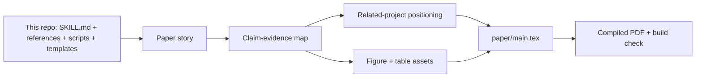

# AI Research Writing Skill

[English](README.md)

[](LICENSE)
[](scripts/README.md)
[](#安装)
[](templates/README.md)

把一个 ML/AI 研究仓库，变成**有证据链、可编译、可投稿的会议论文草稿**。

把代码、实验日志、笔记和会议模板交给 coding agent。这个 skill 会引导它产出可审计的 LaTeX 草稿与投稿材料：论文叙事、claim-evidence map、核验引用、图表、审稿风险和 build notes。

> **论文写作是 claim–evidence 工程，不是散文生成。**  
> 每个重要主张都应能追溯到代码、实验结果、笔记或已核验引用。

---

## 端到端 Demo

```text
使用 AI Research Writing Skill 给这个仓库本身写一篇完整的系统论文。
把 ai-research-writing-skill 当作研究对象。
检查 SKILL.md、references/、scripts/、templates/、跨平台 plugin 文件和 README。
创建 paper_story.md、claim_evidence_map.md、literature positioning、已核验引用、图表，并在 examples/paper-about-ai-research-writing-skill/paper/ 下生成可编译的 LaTeX 论文。
不要编造性能数字。只使用仓库事实作为证据。
```

这个 example 已经包含预期的最终论文包，所以你可以直接查看端到端输出会长什么样：

- `evidence/repository_inventory.md`：作为证据的仓库事实。
- `paper_story.md` 和 `claim_evidence_map.md`：论文叙事与 claim 边界。
- `literature/positioning.md` 和 `citation_verification.md`：相关项目定位。
- `paper/figures/architecture.tex` 和 `paper/tables/*.tex`：论文图表资产。
- `paper/main.tex`：关于本项目的完整论文草稿。
- `build_check.md`：编译命令、预期结果和剩余风险。



## 为什么用这个 skill

| 常见 AI 写论文方式 | AI Research Writing Skill |
|---|---|
| 凭记忆写流畅段落 | 主张与仓库证据一一对应 |
| 引用猜造或编造 | 从 arXiv / DOI / Semantic Scholar 拉 BibTeX |
| 只出 figure 计划、不出图 | Overview / 方法图默认生成；数值图用确定性脚本 |
| 停在提纲 | 落地 `paper_story.md`、`claim_evidence_map.md`、`references.bib`、图文件 |
| 泛泛写作建议 | Venue checklist、审稿人视角自检、编译与打包门禁 |

**模板与 checklist 覆盖：** NeurIPS、ICML、ICLR、CVPR、ICCV、ECCV、ACL、AAAI、COLM 等。正式投稿前务必核对[各会议官方说明](references/venue-templates.md)。

## Before / After

| 使用前 | 使用后 |
|---|---|
| 笔记、日志、草稿散落各处 | `paper_story.md` 和任务包明确边界 |
| claim 听起来合理，但证据不清 | `claim_evidence_map.md` 记录证据状态 |
| 凭记忆补引用 | 从权威元数据获取或核验 BibTeX |
| 只有 figure 想法 | 生成概念图，数值图用确定性脚本 |
| “看起来写完了” | build、TODO、引用、审稿和投稿检查 |

## 和相关项目的区别

本项目不是要替代下面这些优秀的科研写作与绘图项目，而是把它们启发出的能力收束到一个更窄、更深的目标：**把一个 ML/AI 研究仓库，转成有证据链、可编译、可投稿的会议论文包**。

| 项目 | 擅长什么 | 本项目的差异 |
|---|---|---|
| [Master-cai/Research-Paper-Writing-Skills](https://github.com/Master-cai/Research-Paper-Writing-Skills) | 面向 ML/CV/NLP 论文写作的紧凑 skill package，把科研写作笔记整理成可复用 agent skill。 | 在写作指南之外，增加完整 repo-to-paper 生产契约：项目 inventory、claim-evidence map、核验 BibTeX、图表资产、build check 和投稿打包。 |
| [Norman-bury/research-writing-skill](https://github.com/Norman-bury/research-writing-skill) | 通用科研写作助手，覆盖毕业论文、章节写作、文献综述、LaTeX 输出、多平台协作和过程追踪。 | 更专注 AI 会议论文，从代码、日志、实验结果和 venue template 出发，而不是通用 thesis/chapter 写作。 |
| [Orchestra-Research/AI-research-SKILLs](https://github.com/Orchestra-Research/AI-research-SKILLs) | 综合 AI research and engineering skills library，覆盖从 idea 到 paper 的更大研究生命周期。 | 只做一个深垂直：已有 ML/AI 研究仓库的论文写作执行与投稿 readiness。 |
| [Yuan1z0825/nature-skills](https://github.com/Yuan1z0825/nature-skills) | Nature/CNS 风格写作、润色、审稿回复、数据可用性、引用和高影响力期刊图表 workflow。 | 目标 venue 是 ML/AI 会议，如 NeurIPS、ICML、ICLR、CVPR、ICCV、ECCV、ACL、AAAI、COLM。 |
| [ChenLiu-1996/figures4papers](https://github.com/ChenLiu-1996/figures4papers) | 面向顶会和期刊的高质量 Python 科研绘图脚本与示例。 | 把 figure workflow 接入整篇论文链路：图要绑定 claim、证据、caption、LaTeX 引用和投稿检查。 |

一句话：相关项目提供了写作经验、通用技能生态、Nature 风格发表能力或科研绘图能力；本项目把这些启发整合成一个**面向真实 AI 研究仓库的 claim-evidence-engineering 论文 agent workflow**。

---

## 快速开始

**1. 安装**（软链到 agent 的 skills 目录，或使用仓库内置 plugin metadata）：

```bash
git clone https://github.com/jin-s13/ai-research-writing-skill.git
ln -s "$(pwd)/ai-research-writing-skill" ~/.cursor/skills/ai-research-writing-skill   # Cursor 全局
```

更多 Claude Code、Cursor、Codex、Gemini CLI、OpenCode 和 hooks 路径见下方 [安装](#安装)。

**2. 在论文仓库里对 agent 说：**

```text
使用 AI Research Writing Skill 检查这个仓库，并创建 paper_story.md 和 claim_evidence_map.md。
```

**3. 按章节迭代**，例如：

```text
使用 AI Research Writing Skill 修改 Related Work：先建立 literature inventory 和 positioning analysis，再开始写正文。
```

```text
使用 AI Research Writing Skill 规划 Figure 1（method overview），生成图像资产，并把它接入 main.tex。
```

内置脚本仅依赖 **Python 3 标准库**，无需额外安装。

---

## 你能得到什么

从选题叙事到 camera-ready 的完整链路：

| 阶段 | 典型产出 |
|---|---|
| **叙事** | 论点、缺口、贡献、应回避的 claim |
| **证据** | 与代码 / 日志 / 表格绑定的 `claim_evidence_map.md` |
| **写作** | Abstract、Introduction、Related Work、Method、Experiments、Limitations、Conclusion |
| **文献** | 本地语料、定位分析、核验后的 `references.bib` |
| **图表** | 计划 + 文件：**生成图**作 overview / 方法示意；**确定性绘图**承载数值结果 |
| **审稿** | 审稿人视角风险、拒稿点诊断、作者自检 |
| **投稿** | Venue checklist、LaTeX 编译检查、TODO / 引用审计、打包 |

### 工作模式

Agent 按任务只加载需要的 reference，避免“一口气读完整个 `references/`”：

| 模式 | 适用场景 |
|---|---|
| Full-paper | 仓库 + 实验 + 模板 → 草稿或投稿包 |
| Story | 厘清 thesis、gap、贡献边界 |
| Section | 单节修订（加载对应写作指南） |
| Figure | 规划并**实际产出**示意图与结果图 |
| Citation | 检索、核验、修复 BibTeX |
| Reviewer | 投稿前风险扫描 |
| Submission | Checklist、build log、camera-ready |
| Automation | 调用 `scripts/` 做批量检查 |

细则见 [`SKILL.md`](SKILL.md) 与 [`references/README.md`](references/README.md)。

### 内置质量门禁

Skill 要求 agent 不能跳过的检查点：

- **证据** — 数值来自数据 / 日志 / 脚本，而非图像模型  
- **叙事** — 贡献未明确前不写全文草稿  
- **文献** — Related Work 前先完成定位与语料  
- **引用** — 未核验 BibTeX 必须标为 placeholder  
- **图表** — 概念图默认**图像生成**进稿；TikZ/SVG 仅作可选参考  
- **审稿** — 高风险 objection 未处理前不算完成  
- **编译** — 尝试编译或记录阻塞原因  

---

## 安装

克隆本仓库后，复制/软链到对应 agent 的 skills 目录；支持 plugin 的平台也可以直接使用仓库内置的 plugin metadata。

| Agent | 支持方式 | 本仓库入口文件 |
|---|---|---|
| **Claude Code** | Plugin metadata + session hook，或 skill 软链 | `.claude-plugin/plugin.json`, `hooks/` |
| **Cursor** | Plugin metadata + session hook，或 skill 软链 | `.cursor-plugin/plugin.json`, `hooks/` |
| **Codex** | 原生 skill discovery | `SKILL.md`, `agents/openai.yaml`, `.codex/INSTALL.md` |
| **Gemini CLI** | Agent instruction entry | `GEMINI.md` |
| **OpenCode** | Plugin / local skill install | `.opencode/INSTALL.md`, `AGENTS.md` |
| **通用 agent** | 指令入口 | `AGENTS.md` |

### Plugin metadata

仓库提供轻量跨平台入口，所有平台最终都回到同一份根目录 `SKILL.md`，避免不同平台行为分叉。

- Claude Code：`.claude-plugin/plugin.json`
- Cursor：`.cursor-plugin/plugin.json`
- 会话启动 hooks：`hooks/hooks.json`、`hooks/hooks-cursor.json`、`hooks/session-start`、`hooks/run-hook.cmd`
- Gemini CLI：`GEMINI.md`
- 通用 / OpenCode 风格 agent：`AGENTS.md`

### Cursor

全局：

```bash
mkdir -p ~/.cursor/skills
ln -s /path/to/ai-research-writing-skill ~/.cursor/skills/ai-research-writing-skill
```

项目级：

```bash
mkdir -p .cursor/skills
ln -s /path/to/ai-research-writing-skill .cursor/skills/ai-research-writing-skill
```

### Codex

```bash
mkdir -p "$CODEX_HOME/skills"
ln -s /path/to/ai-research-writing-skill "$CODEX_HOME/skills/ai-research-writing-skill"
```

详见 [`.codex/INSTALL.md`](.codex/INSTALL.md)。

### Claude Code

全局：

```bash
mkdir -p "$HOME/.claude/skills"
ln -s /path/to/ai-research-writing-skill "$HOME/.claude/skills/ai-research-writing-skill"
```

项目级：将路径改为 `.claude/skills/` 即可。

支持 plugin 的 Claude Code 安装方式可读取 `.claude-plugin/plugin.json`；内置 session hook 会在会话启动时注入根 skill 入口。

### Gemini

```bash
mkdir -p "$HOME/.gemini/skills"
ln -s /path/to/ai-research-writing-skill "$HOME/.gemini/skills/ai-research-writing-skill"
```

Gemini CLI 也可以读取 `GEMINI.md`，其中直接指向根目录 `SKILL.md`。

### OpenCode

详见 [`.opencode/INSTALL.md`](.opencode/INSTALL.md)。OpenCode 的 plugin/local install 最终也指向根目录 skill。

---

## 仓库结构

```text
ai-research-writing-skill/
├── .claude-plugin/       # Claude Code plugin metadata
├── .cursor-plugin/       # Cursor plugin metadata
├── .codex/               # Codex 安装说明
├── .opencode/            # OpenCode 安装说明
├── hooks/                # plugin-aware host 的 session-start hook
├── AGENTS.md             # 通用 agent 入口
├── GEMINI.md             # Gemini CLI 入口
├── docs/                 # 发布与增长 playbook
├── examples/             # 最小 demo paper repo
├── skills/               # plugin discovery wrapper，回到根目录 SKILL.md
├── SKILL.md              # Agent 入口：模式、门禁、证据策略
├── references/           # 工作流、写作、引用、图表、venue、审稿
│   └── assets/           # 结果图版式参考（figures4papers 风格）
├── scripts/              # Claim、引用、TODO、编译日志、camera-ready 检查
├── templates/            # NeurIPS / ICML / CVPR / ACL / … LaTeX 模板
└── README.md
```

**深入阅读推荐：**

| 文件 | 作用 |
|---|---|
| [`references/workflow.md`](references/workflow.md) | 全文工作流状态机 |
| [`references/artifacts.md`](references/artifacts.md) | 论文仓库里应落盘的产物契约 |
| [`references/figure-workflow.md`](references/figure-workflow.md) | 示意图 vs 结果图；生成图默认策略 |
| [`references/citation-workflow.md`](references/citation-workflow.md) | 检索、核验、BibTeX |
| [`templates/README.md`](templates/README.md) | 模板列表与编译说明 |
| [`examples/paper-about-ai-research-writing-skill/`](examples/paper-about-ai-research-writing-skill/) | 关于本项目自身的端到端论文 demo |
| [`docs/LAUNCH_PLAYBOOK.zh-CN.md`](docs/LAUNCH_PLAYBOOK.zh-CN.md) | 开源增长与发布清单 |

---

## 辅助脚本

```bash
python3 scripts/extract_claims.py main.tex > claim_evidence_map.md
python3 scripts/check_citations.py main.tex references.bib
python3 scripts/check_todos.py main.tex checklist.tex references.bib figures
python3 scripts/parse_build_log.py main.log
python3 scripts/camera_ready_check.py main.tex
python3 scripts/research_quality_gate.py /path/to/paper-project
```

详见 [`scripts/README.md`](scripts/README.md)。

---

## 使用注意

- 内置模板仅为便利副本，**正式投稿前必须核对官方 venue 要求**。  
- 勿将私有 PDF、专有实验日志、API key 或审稿保密材料提交进仓库。

---

## 致谢

本项目参考并借鉴了以下开源 skill 项目的思路与组织方式：

- [Master-cai/Research-Paper-Writing-Skills](https://github.com/Master-cai/Research-Paper-Writing-Skills)
- [Norman-bury/research-writing-skill](https://github.com/Norman-bury/research-writing-skill)
- [Orchestra-Research/AI-research-SKILLs](https://github.com/Orchestra-Research/AI-research-SKILLs)
- [Yuan1z0825/nature-skills](https://github.com/Yuan1z0825/nature-skills)
- [ChenLiu-1996/figures4papers](https://github.com/ChenLiu-1996/figures4papers)

## License

MIT License
