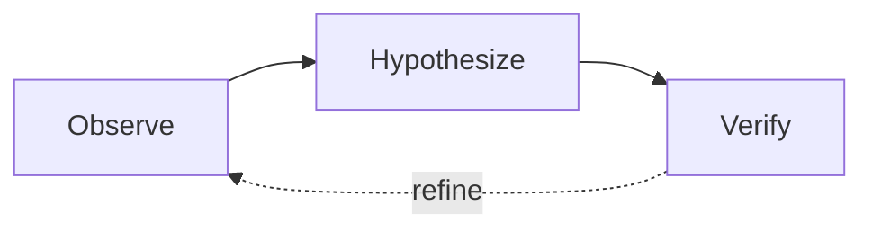

# AI 示意图生成指南

生成有特色、可发表质量示意图的完整提示词工程参考。

## 为何提示词比一切都重要

同一 Gemini 模型，提示词质量不同结果天差地别：
- **泛泛提示** → 无聊的企业流程图、随机配色
- **风格化提示** → 有特色、易记、视觉身份一致

提示词顶部的**风格块**是最关键因素。

## 模型选择

| 模型 | 最适合 | 说明 |
|-------|----------|-------|
| `gemini-3-pro-image-preview` | 各类技术示意图 | 文字渲染最佳、结构保真度最高 |
| DALL-E 3 | 概念插画 | 美感更好，精确文字摆放较弱 |

## 提示词架构（6 节）

### 第 1 节：Framing（5–10 行）

设定语气与上下文，塑造模型整体取向。

**Sketch/简笔画风格**：
```
Create a warm, hand-drawn-style technical diagram for a NeurIPS machine learning
paper. The diagram should feel like a carefully drawn whiteboard sketch —
approachable and clear, with personality in the line work, but still precise
enough for a top venue. Think: the kind of diagram a brilliant researcher would
draw during a coffee chat to explain their system.
```

**Modern Minimal 风格**：
```
Create an ultra-clean, modern technical architecture diagram for an ICML paper.
The diagram should feel like a premium design system — confident, spacious, and
authoritative. Think: Apple's developer documentation meets a Nature paper.
Every element earns its space. No visual noise.
```

**Illustrated Technical 风格**：
```
Create a richly illustrated technical diagram for an ICLR paper. Each component
should have a small, meaningful line-art icon that helps the reader instantly
understand its purpose. The diagram should be self-explanatory — a reader should
grasp the system architecture just by looking at the figure, before reading the
caption. Think: the best technical documentation you've ever seen.
```

### 第 2 节：Visual Style（20–40 行）

**最重要的一节**。从 SKILL.md 复制完整风格块并展开。要极其具体地描述视觉特征。

**原则**：描述*质感*与*材质感*，而非仅几何形状。

好：「线条应像粗马克笔在光滑纸上轻轻晃动」
差：「线条应略不规则」

好：「填充色像稀释墨水渗入湿纸的水彩晕染」
差：「用浅色」

好：「组件靠几乎看不见的阴影浮在背景上（1px 偏移、6px 模糊、3% 不透明度）」
差：「加轻微阴影」

### 第 3 节：Color Palette（10–15 行）

始终写明精确 hex。勿把颜色交给模型随意发挥。

**「Ocean Dusk」色板**（专业、沉静）：
```
COLOR PALETTE (use EXACTLY these colors, no substitutions):
- Primary components: Deep Teal #264653
- Secondary components: Teal #2A9D8F
- Accent / highlights: Gold #E9C46A
- Warm connections: Sandy Orange #F4A261
- Alert / error paths: Burnt Coral #E76F51
- Backgrounds: Warm off-white #FAFAF7
- Text primary: Nearly black #1A1A2E
- Text secondary: Warm gray #6B7280
- Borders (if any): Soft gray #E5E7EB
```

**「Ink & Wash」色板**（简笔画）：
```
COLOR PALETTE — INK AND WASH:
- All outlines and text: Charcoal ink #2C2C2C
- Wash fill 1: Diluted blue #D6E4F0 (like watercolor blue, very soft)
- Wash fill 2: Warm wheat #F5DEB3 (like tea-stained paper)
- Wash fill 3: Soft sage #D4E6D4 (like pale green ink wash)
- Wash fill 4: Faint lavender #E6DFF0 (like diluted purple ink)
- Background: Warm paper #FAFAF7 (NOT pure white — should feel like quality drawing paper)
- Accent marks: Terracotta #C0725E (used sparingly for emphasis)
```

**「Nord」色板**（现代极简）：
```
COLOR PALETTE — NORD:
- Primary: Polar Night #2E3440
- Section fills: Snow Storm #ECEFF4, #E5E9F0, #D8DEE9
- Accent Blue: Frost #5E81AC
- Accent Green: Aurora #A3BE8C
- Accent Yellow: Aurora #EBCB8B
- Accent Red: Aurora #BF616A
- Text: Polar Night #2E3440
- Subtle text: #4C566A
```

### 第 4 节：Layout Description（50–150 行）

**要极尽具体。** 多数提示失败在此 — 过于笼统。

撰写布局说明的规则：
1. **为每个框命名**并写明框内确切文字
2. **明确空间关系**（「Box A 在 Box B 左侧」）
3. **为各组件写副标题/说明**
4. **描述分组**（「这 3 个框在标为 X 的分区内」）
5. **相对尺寸**（「宽约高 2:1」）

**示例（Sketch/简笔画）**：
```
LAYOUT — THREE-STAGE PIPELINE (left to right):

The diagram flows LEFT to RIGHT across three main stages, with a feedback loop
curving back from right to left at the bottom.

STAGE 1 — "Observe" (left third of diagram):
- Draw a rounded blob (not a rectangle!) with soft blue wash fill (#D6E4F0)
- Inside the blob: hand-drawn icon of an EYE (simple line drawing, 3 curved lines)
- Below the icon: "Observe" in bold charcoal
- Below that: "Gather signals from environment" in smaller text
- A small stack of paper sheets icon to the lower-right of the blob,
  labeled "Raw Data" with a tiny arrow pointing into the blob

STAGE 2 — "Hypothesize" (middle third):
- Draw a rounded blob with warm wheat wash fill (#F5DEB3)
- Inside: hand-drawn LIGHTBULB icon (simple: circle + filament lines + base)
- Below: "Hypothesize" in bold
- Below: "Form testable predictions" in smaller text
- Two small thought-bubble circles trailing from the blob upward,
  suggesting the thinking process

STAGE 3 — "Verify" (right third):
- Draw a rounded blob with sage wash fill (#D4E6D4)
- Inside: hand-drawn CHECKMARK icon (a satisfying thick check)
- Below: "Verify" in bold
- Below: "Test against evidence" in smaller text

FEEDBACK LOOP:
- A long curved dashed arrow from "Verify" back to "Observe",
  curving BELOW the three stages
- Label on the arrow: "refine & iterate" in italic
- The arrow should feel like a casual hand-drawn curve, not a geometric arc
```

### 第 5 节：Connections（30–80 行）

逐条描述箭头。箭头承载示意图的语义。

**单条箭头模板**：
```
ARROW [N]: [Source] → [Target]
- Style: [solid / dashed / dotted]
- Color: [hex code]
- Weight: [thin 1px / medium 2px / thick 3px]
- Routing: [straight / curves UP / curves DOWN / bezier around X]
- Label: "[text]" in [italic / bold], positioned [above / below / alongside]
- Arrowhead: [filled triangle / open chevron / circle dot]
```

**各风格箭头惯例**：

| 风格 | 箭头特征 |
|-------|----------------|
| Sketch/简笔画 | 手绘曲线、开放箭头、标签似 casual 手写 |
| Modern Minimal | 细灰线 #6B7280、源端小实心圆、目标端简洁 chevron |
| Illustrated | 与源同色 bezier、中等线宽、标签徽章 |
| Classic Academic | 与源分区同色的实线、实心三角箭头 |

### 第 6 节：Constraints（10–15 行）

按所选风格调整约束：

**Sketch/简笔画**：
```
CONSTRAINTS:
- Lines should look HAND-DRAWN but still legible — wobbly, not chaotic
- NO clip art, NO stock icons, NO photorealistic elements
- NO emoji — icons must be simple LINE DRAWINGS in charcoal
- NO figure numbers, NO captions, NO watermarks
- Background is warm off-white #FAFAF7, NOT pure white
- Overall composition should feel warm and inviting, like a sketchbook page
- Every text label spelled EXACTLY as specified
- Publication quality — this is for NeurIPS, not a napkin sketch
```

**Modern Minimal**：
```
CONSTRAINTS:
- ZERO decoration — no icons, no illustrations, no ornaments
- NO visible borders on component boxes — they float using subtle shadow only
- NO thick colored lines — all connections are thin gray
- NO gradients, NO patterns, NO textures
- Whitespace is a design element — at least 24px between all elements
- NO figure numbers, NO captions, NO watermarks
- Background pure white #FFFFFF
- Every text label spelled EXACTLY as specified
```

## 完整提示词示例

### 示例 1：Agent 系统（Sketch/简笔画）

```
Create a warm, hand-drawn-style technical diagram for a NeurIPS paper showing
an autonomous research agent system. The diagram should feel like a carefully
drawn whiteboard sketch — approachable yet precise.

VISUAL STYLE — HAND-DRAWN SKETCH:
- Slightly irregular, hand-drawn line quality — lines wobble gently, not perfectly straight
- Rounded, soft shapes with visible pen strokes (like drawn with a thick felt-tip marker)
- Warm off-white background (#FAFAF7)
- Fill colors are soft watercolor washes: blue #D6E4F0, wheat #F5DEB3, sage #D4E6D4
- Borders are charcoal #2C2C2C, 2-3px, slightly uneven
- Arrows hand-drawn with natural curves, open arrowheads
- Small doodle-style line-art icons inside each component (NOT emoji, NOT clip art)
- Text in rounded sans-serif, warm and readable

COLOR PALETTE — INK AND WASH:
- Outlines/text: Charcoal #2C2C2C
- Planner fill: Blue wash #D6E4F0
- Executor fill: Wheat wash #F5DEB3
- Verifier fill: Sage wash #D4E6D4
- Background: Warm paper #FAFAF7
- Failure/retry: Terracotta #C0725E

LAYOUT — TRIANGULAR ARRANGEMENT:
Three rounded blob shapes arranged in a triangle:

TOP CENTER — "Planner" blob:
- Blue wash fill (#D6E4F0)
- Line-art icon: a small COMPASS or MAP (simple 2D line drawing)
- Bold label: "Planner"
- Subtitle: "Decomposes research questions"

BOTTOM LEFT — "Executor" blob:
- Wheat wash fill (#F5DEB3)
- Line-art icon: a small GEAR or WRENCH
- Bold label: "Executor"
- Subtitle: "Runs experiments & tools"

BOTTOM RIGHT — "Verifier" blob:
- Sage wash fill (#D4E6D4)
- Line-art icon: a small MAGNIFYING GLASS
- Bold label: "Verifier"
- Subtitle: "Checks results & evidence"

ARROWS:
1. Planner → Executor: curved arrow going DOWN-LEFT, charcoal, solid
   Label: "task plan" (italic, small)
2. Executor → Verifier: curved arrow going RIGHT, charcoal, solid
   Label: "raw results" (italic, small)
3. Verifier → Planner: curved arrow going UP-LEFT, terracotta #C0725E, DASHED
   Label: "needs revision" (italic, small)
   This is the feedback/retry path — dashed to show it's conditional

CENTER of triangle: small text "Shared Memory" with a tiny notebook icon

CONSTRAINTS:
- Hand-drawn feel but still publication quality for NeurIPS
- NO clip art, NO stock icons — only simple line drawings
- NO figure numbers, NO captions
- Warm off-white background, NOT pure white
- Every label spelled EXACTLY as written
```

### 示例 2：训练流水线（Modern Minimal）

```
Create an ultra-clean, modern technical architecture diagram for an ICML paper.
Confident, spacious, authoritative. Think: Apple developer docs meets Nature paper.

VISUAL STYLE — MODERN MINIMAL:
- Ultra-clean geometric shapes with crisp edges
- Bold color blocks as section fills using desaturated tones
- Component boxes: 12px rounded corners, NO visible border, float on section
  background with subtle shadow (1px, 4px blur, rgba(0,0,0,0.06))
- ONE accent color per section, used on section header only
- Arrows: thin 1.5px, dark gray #6B7280, small filled circle at source,
  clean open chevron at target
- Typography: system sans-serif, titles 600 weight, body 400 weight
- Labels INSIDE boxes, generous whitespace (24px+ between elements)

COLOR PALETTE — NORD:
- Deep text: #2E3440
- Section 1 fill: #EEF1F6 (blue tint), accent: #5E81AC
- Section 2 fill: #EDF3ED (green tint), accent: #A3BE8C
- Section 3 fill: #F5F2EA (yellow tint), accent: #EBCB8B
- Box fill: White #FFFFFF
- Arrows: #6B7280

LAYOUT — THREE HORIZONTAL SECTIONS:
Three wide horizontal bands, stacked vertically with 16px gaps.
Each section is a full-width rounded rectangle (8px corners).

[SECTION 1 — "Data" — blue tint background #EEF1F6]
- Small section header top-left: "DATA" in #5E81AC, small caps, letter-spaced
- Three white floating boxes in a row:
  Box: "Corpus" / "1.2T tokens"
  Box: "Filter" / "Quality + dedup"
  Box: "Tokenize" / "BPE 32K"

[SECTION 2 — "Train" — green tint background #EDF3ED]
- Header: "TRAIN" in #A3BE8C
- Three white floating boxes:
  Box: "Model" / "7B · 32 layers"
  Box: "Optimize" / "AdamW · cosine"
  Box: "Checkpoint" / "Every 1K steps"

[SECTION 3 — "Evaluate" — yellow tint background #F5F2EA]
- Header: "EVALUATE" in #EBCB8B
- Three white floating boxes:
  Box: "Benchmark" / "MMLU · HumanEval"
  Box: "Analyze" / "Scaling curves"
  Box: "Report" / "Camera-ready"

ARROWS:
1. "Tokenize" → "Model": thin gray #6B7280, vertical, label "feeds"
2. "Checkpoint" → "Benchmark": thin gray, vertical, label "evaluate"
3. "Analyze" → "Report": thin gray, horizontal, label "publish"

CONSTRAINTS:
- ZERO decoration — no icons, no illustrations
- NO visible box borders — shadow only
- Generous whitespace between all elements
- NO figure numbers, NO captions, NO watermarks
- Background: pure white #FFFFFF
- All labels EXACTLY as written
- Publication quality for ICML 2026
```

## 多次尝试评分量表

按下列 5 维打分（1–5）：

| 维度 | 检查项 | 权重 |
|-----------|---------------|--------|
| **风格保真** | 是否符合目标视觉风格？（手绘感、极简等） | 30% |
| **文字准确** | 标签拼写正确、无多余文字？ | 25% |
| **布局保真** | 空间排布是否符合提示？ | 20% |
| **颜色准确** | 颜色是否符合 hex、是否一致？ | 15% |
| **连接准确** | 箭头是否齐全、路径与标签正确？ | 10% |

**风格保真失败**：加强风格块，加入更多感官描述。可加「整体美学应类似 [具体参考]。」

**文字失败**：加 `CRITICAL: The word "[exact word]" must appear EXACTLY. Do not abbreviate, do not change capitalization.`

**布局失败**：加显式坐标或网格。「Box A 位于 (left: 10%, top: 20%)。」

## TikZ 替代方案（LaTeX 原生图）

示意图足够简单、需要确定性输出时使用：

```latex
\begin{tikzpicture}[
    box/.style={draw=#1, fill=#1!8, rounded corners=6pt, minimum width=2.8cm,
                minimum height=1cm, font=\small\sffamily, line width=0.8pt},
    lbl/.style={font=\scriptsize\sffamily\itshape, text=#1},
    arr/.style={-{Stealth[length=5pt]}, line width=0.8pt, color=#1},
]
    \node[box=teal]   (plan) at (0,0)    {Planner};
    \node[box=orange]  (exec) at (4,0)    {Executor};
    \node[box=olive]   (veri) at (8,0)    {Verifier};

    \draw[arr=gray]  (plan) -- (exec) node[midway, above, lbl=gray] {task plan};
    \draw[arr=gray]  (exec) -- (veri) node[midway, above, lbl=gray] {results};
    \draw[arr=red!60, dashed] (veri) to[bend right=30]
        node[midway, below, lbl=red!60] {revise} (plan);
\end{tikzpicture}
```

## Mermaid 快速原型

投入完整 Gemini 提示前先勾勒逻辑流：



确认结构正确后再写完整 Gemini 提示词。
