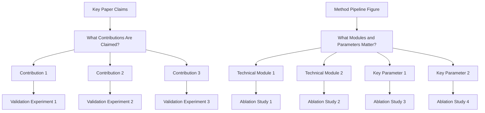
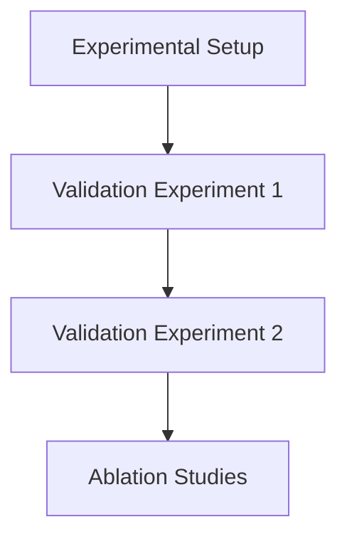

# 实验写作指南

## 目标

用关于有效性、因果性与实用价值的完整证据说服审稿人。

## 三个核心问题

1. 方法是否优于强基线？
   - 与强且近期的基线做对比实验。
   - 在主基准上报告标准指标。
   - 包含 SOTA 或最强公开方法，而非仅弱基线。
   - 保持协议公平（相同数据划分、预处理与评估设定）。
2. 哪些模块/设计选择带来收益？
   - 对每个关键模块/设计选择做消融。
   - 使用移除/替换/禁用变体，并报告相对完整模型的增量。
   - 模块耦合时包含组件交互消融。
3. 方法在更难设定下能泛化多远？
   - 在更难或分布外设定上做演示/评估。
   - 增加压力测试场景（更复杂场景、更罕见案例、更噪输入或更严约束）。
   - 同时报告收益与失败模式，以展示现实边界。

## 实验规划

## 实验节分解

## 图/表写作规则

`好的表格是实验沟通质量的一部分，而非装饰。`

1. 图注与表注在 Experiments 写作质量中同等重要。

### 硬性规则

1. 表题放在表格上方。
2. 避免在 tabular 列中使用竖线（`|`）。
3. 不要使用双线或密集的 `\hline` 堆叠。
4. 使用 `booktabs` 风格（`\toprule`、`\midrule`、`\bottomrule`）保持结构清晰。
5. 尽量少用横线；线应分隔组，而非每一行。
6. 用轻微颜色强调关键数字（最优/次优或目标行）。

### 审稿实践中的可读性规则

1. 在列标题中标明指标方向（例如 `PSNR ↑`、`LPIPS ↓`）。
2. 需要时加单位，使数值无需猜测即可理解。
3. 文本列左对齐；数值列对齐方式一致。
4. 数值精度一致（同一指标列小数位相同）。
5. 多数据集或多设定结果用 `\multicolumn` + `\cmidrule` 分组，不用竖线分隔。
6. 一表一信息：不要在单表中混杂无关结果。
7. 若行代表不同属性/消融，在行名或属性列中明确编码。
8. 表题聚焦设定/协议/记号，不要长篇讨论。
9. 若细节不多，用一句简洁话概括主要结果。
10. 双栏论文中的单栏图/表，在版式允许时优先放在右栏，以便读者从左上方正文进入页面而不打断阅读流。

### 最小 LaTeX 检查清单

1. 在导言区添加：`\usepackage{booktabs}`、`\usepackage{colortbl,xcolor}`（可选 `\usepackage{siunitx}` 用于小数对齐）。
2. 用 `\toprule/\midrule/\bottomrule` 替代 `\hline` 密集风格。
3. `\caption{...}` 放在 `\label{...}` 之前，且表题在上方。
4. 强调要克制；不要给过多单元格上色。

## 推荐消融组合

1. 一张核心消融表覆盖所有主要贡献。
2. 若干聚焦的小型消融对应模块级设计选择。
3. 每个重要消融配有匹配的定性可视化结果。

## 实验严谨性检查清单

1. 基线是否近期且相关？
2. 指标是否充分且符合该任务标准？
3. 消融是否与每条关键设计主张对应？
4. Abstract/Introduction 中的主张是否有报告数字支撑？
5. 是否明确说明评估范围的局限？
