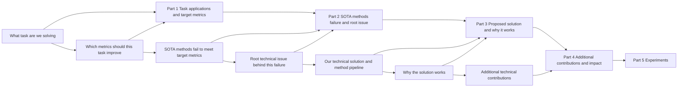

# 引言写作指南

## 目标

分三步写出强有力的引言：

1. 想清楚引言逻辑。
2. 选用下面合适的模板。
3. 反复修订引言。

## 引言逻辑图



## 如何构思引言：先倒推，再正写

### 倒推（先回答这些）

1. 我们解决什么技术问题？为何尚无成熟方案？（重要）
2. 我们的 pipeline 有哪些贡献（例如新任务、新指标、新技术问题或新技术）？
3. 这些贡献有何益处、为何能解决该技术挑战、带来何种新洞见？（重要）
4. 如何用前人方法把读者引向我们已解决的挑战与新洞见？

### 正写故事（按此顺序写）

1. 介绍论文任务。
2. 用前人工作引向我们所解决的技术挑战。
3. 呈现若干贡献以解决该技术挑战。
4. 说明贡献的技术优势，并明确表达我们的新洞见。（重要）

## 章节骨架

```latex
\section{Introduction}
% Task and application
% Technical challenge for previous methods (discuss around the technical challenge that we solved. A technical challenge includes both limitation and technical reason)
% Introduce our pipeline for solving the challenge
% Experiment
% Contributions
```

## 第一部分：介绍任务与应用

### 版本 1

`版本 1：若任务相对小众，先介绍任务，再介绍应用。`

写作结构：

1. 用一句清晰定义任务（从 `什么输入` 得到 `什么输出`）。
2. 简要说明任务目标或范围（可选）。
3. 用 2–3 个代表性场景介绍应用价值。

句式骨架：

1. `[xxx task] targets at recovering/reconstructing/estimating [xxx output] from [xxx input].`
2. `[xxx task] has a variety of applications such as [xxx], [xxx], and [xxx].`

本地引用：

1. `references/examples/introduction/version-1-task-then-application.md`

### 版本 2

`版本 2：若任务对多数读者已熟悉，可直接从应用切入。`

写作结构：

1. 跳过正式任务定义。
2. 用一句简洁的话开篇强调应用重要性。
3. 可选补充目标要求（如精度/效率/鲁棒性）。

句式骨架：

1. `[xxx task] has a variety of applications such as [xxx], [xxx], and [xxx].`

本地引用：

1. `references/examples/introduction/version-2-application-first.md`

### 版本 3

`版本 3：先介绍一般任务的应用，再介绍本文的具体任务设定。（设定较新时个人更推荐。）`

写作结构：

1. 从一般任务及其重要性入手。
2. 收窄到本文的具体设定。
3. 明确输入/输出及设定边界。

句式骨架：

1. `[general task] has a variety of applications such as [xxx], [xxx], and [xxx].`
2. `This paper focuses on the specific setting of recovering/reconstructing/estimating [xxx output] from [xxx input].`

本地引用：

1. `references/examples/introduction/version-3-general-to-specific-setting.md`

### 版本 4

`版本 4：若任务已熟悉，可直接介绍应用，并在开篇通过前人方法（失败案例/目标指标改进）暴露目标技术挑战。`

写作结构：

1. 从任务/应用重要性开篇。
2. 立即概括代表性前人方法如何工作。
3. 立即暴露未解决的失败案例 + 技术原因。
4. 将此开篇作为后文前人工作段落的桥梁。

开篇段落骨架：

1. `[Task/application importance sentence].`
2. `Given input ..., previous methods usually ...`
3. `Although they work in many cases, they fail at ... because ...`

专家要点：

1. 若第一段已点明要解决的问题，往往更好，而不必等多段前人工作后才出现挑战。
2. 此风格需合适条件，较不常见。
3. 典型版本 4 流程：第一部分（任务+应用，并通过前人方法 1 直接暴露挑战）→ 第二部分（前人方法 2 试图解决但仍失败）→ 第三部分（我们的方法）。
4. 更常见的通用流程：第一部分（任务+应用）→ 第二部分（前人方法 1 + 局限）→ 第三部分（前人方法 2 + 局限；目标挑战在此浮现）→ 第四部分（我们的方法）。

本地引用：

1. `references/examples/introduction/version-4-open-with-challenge.md`

## 第二部分：介绍前人方法的技术挑战（非常重要）

目的：

1. 围绕我们实际解决的确切技术挑战展开讨论。
2. 激发读者对如何解决该挑战的好奇。
3. 使我们的方法动机/益处清晰。

动笔前的关键逻辑（忠实译述）：

1. 先理清「引向我们所解决的技术挑战」的逻辑。
2. 对已有任务：弄清哪些近期方法存在该挑战、这些方法为何存在，以及（可选）它们曾试图解决何种更早的挑战。
3. 对新任务：至少定义我们的 pipeline 所解决的技术挑战。

重要警告：

1. 不要先呈现朴素方案，再描述我们相对它的改进。
2. 那样写会让工作看起来像低分增量补丁。
3. 即使工作实际是增量的，也不要这样写。
4. 原因：这种写法会抹杀读者好奇心，并让想法显得直白，只因写作在手把手引导读者。

### 技术挑战版本 1（已有任务，已有方法）

`版本 1：对已有任务，讨论从一般挑战 → 传统方法 → 近期方法 → 我们解决的剩余挑战这一链条。`

写作结构：

1. 从该任务的一般挑战陈述入手。
2. 简要概括传统方法及其局限。
3. 简要概括近期方法（1）及其局限与技术原因。
4. 简要概括近期方法（2）及其局限与技术原因。
5. 确保最终局限正是你的方法所解决的挑战。

句式骨架：

1. `This problem is particularly challenging due to ...`
2. `To overcome these challenges, traditional methods ... However, they ...`
3. `Recently, ... methods ... However, they ... because ...`
4. `To overcome this challenge, ... methods ... However, they ... because ...`

本地引用：

1. `references/examples/introduction/technical-challenge-version-1-existing-task.md`

### 技术挑战版本 2（已有任务 + 洞见可追溯到传统方法）

`版本 2：对已有任务，若我们的洞见在传统方法中已有渊源，用该脉络提供概念支撑，再说明新方法为何仍失败。`

写作结构：

1. 从主流方法及其局限入手。
2. 介绍已包含与我们类似洞见的经典/传统路线。
3. 解释该经典路线仍不足的原因。
4. 回到现代方法，展示未解决的技术原因。
5. 自然过渡到我们的方法。

句式骨架：

1. `Traditional/recent methods ... However, they ... because ...`
2. `To overcome this problem, a typical approach is [insight], which has long been explored ...`
3. `However, these methods still ... because ...`
4. `To overcome this challenge, newer methods ... However, they ... because ...`

本地引用：

1. `references/examples/introduction/technical-challenge-version-2-existing-task-insight-backed-by-traditional.md`

### 技术挑战版本 3（新任务，无直接方法）

`版本 3：对无直接前人方法的新任务，直接定义挑战，并分解为若干具体挑战点。`

写作结构：

1. 陈述目标，说明该问题因 N 个原因而具有挑战性。
2. 用 `First/Second/Finally` 分隔独立挑战点。
3. 每点陈述可观察的局限与技术原因。
4. 以过渡到我们的 pipeline 结束。

句式骨架：

1. `In this work, our goal is to ... This problem is challenging for three reasons.`
2. `First, ...`
3. `Second, ...`
4. `Finally, ...`

本地引用：

1. `references/examples/introduction/technical-challenge-version-3-novel-task.md`

## 第三部分：介绍解决挑战的 pipeline

动笔前的关键问题：

### 已有任务

1. 我们的 pipeline 解决什么技术挑战？
2. 我们的技术贡献是什么？
3. 我们的方法在本质上为何能奏效？
4. 相对前人方法有何益处？

### 新任务

1. 我们的 pipeline 解决什么技术挑战？
2. 我们的技术贡献是什么？
3. 我们的方法在本质上为何能奏效？

### Pipeline 版本 1

`版本 1：一项贡献、多项优势，并用一张 teaser 图呈现基本思路。`

写作结构：

1. 介绍面向目标任务的核心框架/表示。
2. 指向 teaser 图说明基本思路。
3. 用一句点明关键新颖性。
4. 解释具体实现步骤（`Specifically, ...`）。
5. 陈述多项优势（`In contrast ...`、`Another advantage ...`）。

句式骨架：

1. `In this paper, we propose a novel framework/representation, named ..., for ...`
2. `The basic idea is illustrated in Figure ...`
3. `Our innovation is in ...`
4. `Specifically, ...`
5. `In contrast to previous methods, ...`
6. `Another advantage of the proposed method is that ...`

本地引用：

1. `references/examples/introduction/pipeline-version-1-one-contribution-multi-advantages.md`

### Pipeline 版本 2

`版本 2：两项贡献，并用一张 teaser 图呈现基本思路。`

写作结构：

1. 介绍框架与关键新颖性句。
2. 指向 teaser 图。
3. 解释贡献 1 及其优势。
4. 引出剩余挑战。
5. 将贡献 2 作为对该挑战的回应。

句式骨架：

1. `In this paper, we propose ...`
2. `Our innovation is in ...`
3. `The basic idea is illustrated in Figure ...`
4. `Specifically, ...`（贡献 1）
5. `In contrast to previous methods, ...`
6. `However, ...`（剩余挑战）
7. `Specifically, ...`（贡献 2）

本地引用：

1. `references/examples/introduction/pipeline-version-2-two-contributions.md`

### Pipeline 版本 3

`版本 3：在既有 pipeline 上增加一个新模块，并用 teaser 图呈现基本思路。`

写作结构：

1. 从既有 pipeline 设定入手。
2. 将一个新模块作为关键创新引入。
3. 给出驱动模块设计的观察。
4. 解释模块机制。
5. 与通用替代方案对比并说明为何更好。

句式骨架：

1. `Inspired by previous methods, ...`
2. `Our innovation is introducing ...`
3. `We observe that ...`
4. `Considering that ..., we introduce ...`
5. `In contrast to ..., our module ...`

本地引用：

1. `references/examples/introduction/pipeline-version-3-new-module-on-existing-pipeline.md`

### Pipeline 版本 4

`版本 4：贡献来自一项重要观察。先介绍关键创新，再以易懂的观察作动机，然后写方法细节与益处。`

写作结构：

1. 先陈述关键创新。
2. 用一句直观观察作动机。
3. 解释实现细节。
4. 解释技术优势与实证收益。

句式骨架：

1. `Our innovation is ...`
2. `We observe that ...`
3. `Considering that ..., we ...`
4. `This leads to ... and achieves ...`

本地引用：

1. `references/examples/introduction/pipeline-version-4-observation-driven.md`

### 不推荐写法

`不推荐：若方法较简单，不要在 Introduction 中隐藏具体方法设计、只写抽象洞见来显得新颖。`

专家要点：

1. 此模板的写作技巧在于让简单 pipeline 听起来新颖。
2. 关键警示：人们常让 pipeline 步骤显得新颖，而非真正的洞见。
3. 多数情况下不推荐。更好目标是在 Introduction 中清楚解释核心贡献的实现。

为何不推荐（写作结构警示）：

1. 只呈现抽象洞见而无具体 pipeline 步骤会削弱技术清晰度。
2. 引入许多新术语却无机制级解释会造成新颖性错觉。
3. 审稿人可能将其解读为肤浅或增量工作。

本地引用：

1. `references/examples/introduction/pipeline-not-recommended-abstract-only.md`

## 范例库

1. `references/examples/introduction-examples.md`
2. `references/examples/introduction/version-1-task-then-application.md`
3. `references/examples/introduction/version-2-application-first.md`
4. `references/examples/introduction/version-3-general-to-specific-setting.md`
5. `references/examples/introduction/version-4-open-with-challenge.md`
6. `references/examples/introduction/technical-challenge-version-1-existing-task.md`
7. `references/examples/introduction/technical-challenge-version-2-existing-task-insight-backed-by-traditional.md`
8. `references/examples/introduction/technical-challenge-version-3-novel-task.md`
9. `references/examples/introduction/pipeline-version-1-one-contribution-multi-advantages.md`
10. `references/examples/introduction/pipeline-version-2-two-contributions.md`
11. `references/examples/introduction/pipeline-version-3-new-module-on-existing-pipeline.md`
12. `references/examples/introduction/pipeline-version-4-observation-driven.md`
13. `references/examples/introduction/pipeline-not-recommended-abstract-only.md`

## 快速质量检查清单

1. 每段首句是否点明该段信息？
2. 每段是否只传达一个信息？
3. 技术挑战、技术原因与解决机制是否都明确？
4. Introduction 中的主张是否与实验证据一致？
5. 全文术语是否在各节间稳定一致？
