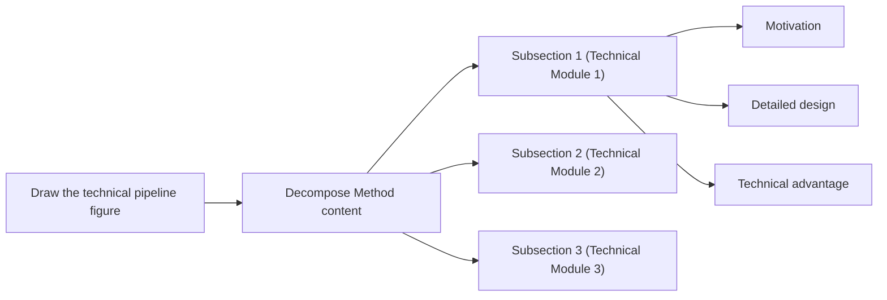
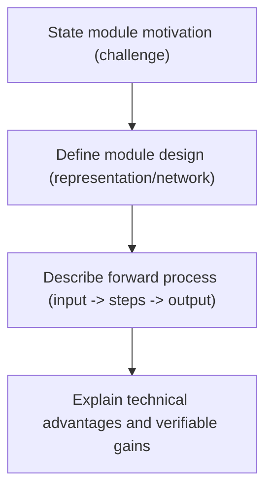

# 方法写作指南

## 目标

按以下顺序清晰撰写 Method 节：

1. 回答关键方法设计问题。
2. 绘制 pipeline 图草图。
3. 逐步撰写方法节。

## 写作前问题

`写 Method 前先回答：(1) 方法中有哪些模块，(2) 每个模块的工作流是什么、为何需要该模块、该模块为何能奏效。`

推荐组织方式：

1. 列出 pipeline 中所有模块。
2. 对每个模块回答三个问题：

- 模块如何运行？
- 为何需要该模块？
- 该模块为何能奏效？

3. 将答案整理为思维导图或表格以便清晰呈现。

## 方法写作步骤

`方法写作步骤：(1) 画 pipeline 图草图，(2) 由草图映射子节结构，(3) 为每个子节规划动机/设计/优势，(4) 先写模块设计，(5) 再补充动机与技术优势。`

逐步工作流：

1. 绘制 pipeline 图草图。
2. 用草图组织 Method 子节结构。
3. 为每个子节规划三部分：动机、模块设计、技术优势。
4. 先写模块设计以建立具体骨架。
5. 再补充动机与技术优势。

## Pipeline 模块三要素

`一个 pipeline 模块包含三要素：模块设计、该模块的动机、该模块的技术优势。`

### 1）模块设计

定义：

1. 描述表示/网络/数据结构细节。
2. 清晰描述前向过程：给定输入 → 步骤 1 → 步骤 2 → 步骤 3 → 输出。

### 2）该模块的动机

定义：

1. 解释为何需要该模块。
2. 用问题驱动逻辑：因存在问题 X，我们设计模块 Y。

### 3）该模块的技术优势

定义：

1. 解释该模块相对替代方案的技术优势。
2. 尽可能将优势与可度量行为关联。

### 三要素示例

本地引用：

1. `references/examples/method/example-of-the-three-elements.md`

## 方法内容分解



## 如何写模块设计

`模块设计通常分两部分：(1) 描述具体数据/网络结构，(2) 按输入 → 步骤 → 输出描述前向过程。`

写作结构：

1. 先定义关键结构（表示、网络、数据结构）。
2. 严格按执行顺序写前向过程。
3. 以输出解释或用途结束。

句式骨架：

1. `We represent ... with ...`
2. `Given [input], we first ... then ... finally ...`
3. `This produces [output], which is used for ...`

本地引用：

1. `references/examples/method/module-design-instant-ngp.md`

## 如何写模块动机

`模块动机通常由问题驱动：因存在某问题，我们设计 xx 来解决。`

典型开篇句：

1. `A remaining problem/challenge is ...`
2. `However, we ...`
3. `Previous methods have difficulty in ...`

本地引用：

1. `references/examples/method/module-motivation-patterns.md`

## 如何检查方法是否易懂

`从三个层次检查方法清晰度：写作逻辑、段落写作、句子写作。`

### 1）逻辑层检查

1. 论文完成后，再次概括 Method 的写作逻辑。
2. 检查该概括是否顺畅、易跟。

### 2）段落层检查

1. 每段首句应让读者立刻明白本段讲什么。
2. 一段应清晰传达一个信息。

### 3）句子层检查

1. 仔细检查每句的**动机**是否明确。始终让读者清楚：**为何需要这句内容**。
2. 仔细检查句间衔接。
3. 仔细检查术语一致，避免关键术语来回更换。

## Method 节骨架

```latex
\section{Method}
% Overview
% Section 3.1
% Section 3.2
% Section 3.3
```

本地引用：

1. `references/examples/method/section-skeleton.md`

## Overview 子节

`Overview 通常包括：设定、核心贡献、可选的 pipeline 图指引，以及各子节内容地图。`

写作结构：

1. 一至两句说明任务设定。
2. 一至两句说明核心贡献。
3. 若 pipeline/框架新颖，指向 overview 图。
4. 告诉读者 Section 3.1/3.2/3.3 各涵盖什么。

本地引用：

1. `references/examples/method/overview-template.md`

## Section 3.1 及其他模块子节

`基本子节逻辑：(1) 该模块动机，(2) 模块前向过程/模块设计，(3) 该模块技术优势。`

本地引用：

1. `references/examples/method/example-of-the-three-elements.md`

## 模块写作模式（Mermaid）



## 实现细节

`实现细节包括超参数（如层数、特征维度）、坐标变换/归一化及其他实用细节。放在 Method 末尾或单独的 Implementation Details 节。`

## 范例库

1. `references/examples/method-examples.md`
2. `references/examples/method/pre-writing-questions.md`
3. `references/examples/method/module-triad-neural-body.md`
4. `references/examples/method/module-design-instant-ngp.md`
5. `references/examples/method/module-motivation-patterns.md`
6. `references/examples/method/section-skeleton.md`
7. `references/examples/method/overview-template.md`
8. `references/examples/method/example-of-the-three-elements.md`
9. `references/examples/method/method-writing-common-issues-note.md`
